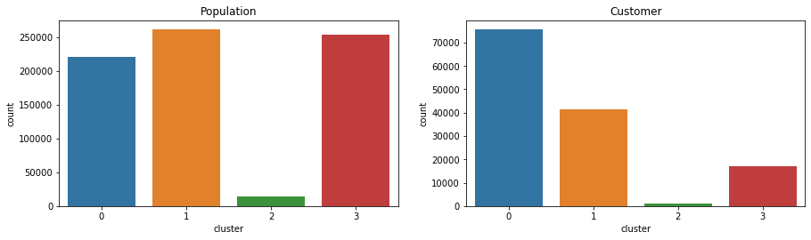
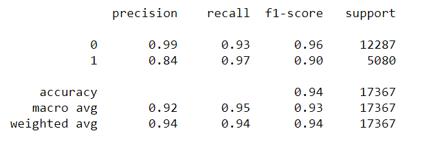

# Customer-Segmentation-Report

### Table of Contents

1. [Project Motivation](#motivation)
2. [Description of files](#data)
3. [Summary](#summary)
4. [Results](#results)
5. [How to Interact with the project](#libraries)
6. [References](#references)

## Motivation
In this project, we will analyze demographics data for customers of a mail-order sales company in Germany, comparing it against demographics information for the general population. We'll use unsupervised learning techniques to perform customer segmentation, identifying the parts of the population that best describe the core customer base of the company. Then, we'll apply what we've learned on a third dataset with demographics information for targets of a marketing campaign for the company, and use a model to predict which individuals are most likely to convert into becoming customers for the company. The data that we will use has been provided by Udacity's partners at Bertelsmann Arvato Analytics, and represents a real-life data science task.

## Data
In this repository, you'll find the Jupyter notebook which has been used during the project. 
In this project we are provided with 4 datasets in total. The data used for this project not publically available. 
It was provided only to those participating in the competition:
* AZDIAS: Demographics data for the general population of Germany.
* CUSTOMERS: Demographics data for customers of a mail-order company.
* MAILOUT_TRAIN & MAILOUT_TEST: Demographics data for individuals who were targets of a marketing campaign.

## Summary

We approach this project in 2 phases :
* Use Unsupervised Learning to perform customer segmentation and identify clusters/segments from general population who best match mail-order company’s customer base.
* Use Supervised Learning to identify targets for marketing campaign of the mail-order company who could possibly become their customers.

## Results
 Unsupervised Learning results:

Supervised Learning results:

The detailed analysis of the results can be read in this [Medium post](https://medium.com/@vally.selvarasa/create-a-customer-segmentation-report-65162985d907)

## Libraries
Python 3.7.3

The libraries we will be using will be:

* imbalanced-learn==0.6.1
* numpy==1.18.1
* pandas==0.23.4
* scikit-learn==0.22.1
* seaborn==0.9.0

## References
[Correlation](https://towardsdatascience.com/why-feature-correlation-matters-a-lot-847e8ba439c4)

[Under/Over sampling](https://www.kaggle.com/residentmario/undersampling-and-oversampling-imbalanced-data)

[Adaboost Classifier](https://towardsdatascience.com/machine-learning-part-17-boosting-algorithms-adaboost-in-python-d00faac6c464)

